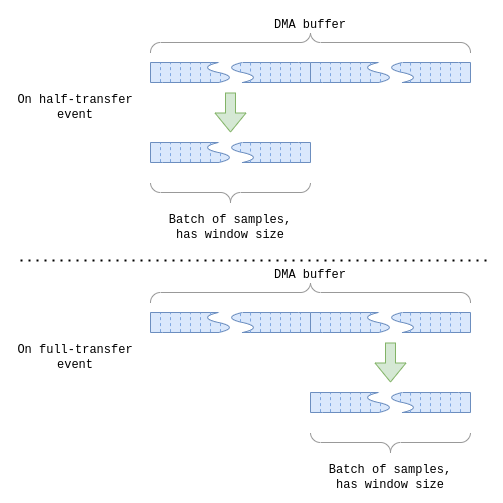

Jeff's firmware tech stack:

* C++20,
* FreeRTOS,
* driver code generated with CubeMX, in C language,
* CMake-based build system,
* Python3 scripting to support the build system,
* host-side unit-testing framework: Catch2,
* device-side unit-testing framework: ThrowTheSwitch/Unity.

# Table of Contents

- [Building, running and testing](#building-running-and-testing)
- [Firmware Architecture](#firmware-architecture)
- [Guitar Effects](#guitar-effects)
- [Creating a new Guitar Effect](#creating-a-new-guitar-effect)
- [Contributing](#contributing)

# Building, running and testing

This is intended to be run under Linux, but it might work for Windows as well with few tweaks.

To prepare for building and testing one should run from the `firmware/` directory:

```
mkdir -p build/build_{host,device}_{debug,release}
```

This will prepare empty directories for host-side and device-side builds, for Debug and Release configuration.

## Building firmware

```
cd build/build_device_release
cmake ../../device # CMAKE_BUILD_TYPE=Release by default
cmake --build .
```

The debug build:

```
cd build/build_device_release
cmake -DCMAKE_BUILD_TYPE=Debug ../../device
cmake --build .
```

## Setting up the device

Currently, NUCLEO-L432KC (STM32L432KC-Nucleo) is used, so all the flasher scripts use `openocd`. The Nucleo board has
on-board programmer, but STLinkV2 or JLink could work too. Anyway, the requirements:

* [openocd](https://openocd.org/)
* `python3`
* `ruby`
* Python packages: `python3 -m pip install click pyserial`

## Connecting the Serial port

Logs are collected from the device. Currently, they are outputted on A7 Nucleo pin (PA2 on the MCU). Connect this pin to
the RXD pin on the USB-UART converter.

The config is 8 data bits, no parity, 1 stop bit, 115200 baud rate.

To make use of the automation of the tests `JEFF_SERIAL_PORT` CMake cache variable must be set. To set it run from the
appropriate build directory:

```
cmake -DJEFF_SERIAL_PORT:STRING=<device_name> ../../device
```

e.g. on Linux:

```
cmake -DJEFF_SERIAL_PORT:STRING=/dev/ttyUSB0 ../../device
```

## Flashing

```
cmake --build . --target distortion_app-flash
```

## Device tests

CTest module is used to run the tests. One can use `--verbose` flag to see more output, or `--output-on-failure`.

### 1. Audio sampler tests

Basic tests, which check the basic module operation (without signal generations checks) can be run with:

```
ctest -R test_audio_sampler_basic
```

To see whether sampling works properly, connect function generator to the input circuit. You can connect it before the
DC offset circuit or after it, directly to the ADC input pin A0, on Nucleo board (PA0 on the MCU). Be wary that if
connecting before the DC offset circuit, the signal must be ±1.6V (no DC offset), or if connecting after it the DC
offset must be applied to 1.65 V, so the signal amplitude shall ba 1.6V.

Multiple tests are created for various input signal frequencies. For each test, corresponding input signal frequency
must be applied for the sine wave:

```
ctest -R test_sample_sine_100hz
ctest -R test_sample_sine_1khz
ctest -R test_sample_sine_10khz
ctest -R test_sample_sine_20khz
```

The test calculates FFT and checks whether the corresponding spike is in the signal. SNR is calculated basing on the
power of the corresponding spike: power of the spike is divided by the sum of powers of other frequencies. If the SNR is
higher than 0.5 (or around that value), then the test is successful.

### 2. Audio DAC tests

Running basic module tests, for firmware correctness:

```
ctest -R test_audio_dac_basic
```

To verify the DAC, one can flash 1kHz sine wave generator:

```
cmake --build . --target test_audio_dac_generates_sine_1khz-flash
```

Then connect oscilloscope to the Nucleo board pin A3 (PA4) to verify whether ~ <0;3V3>, 1kHz sine wave is at the output.
The sine wave will of course be stepwise.

### 3. Test audio chain

To verify basic application without any guitar effect, one can run:

```
cmake --build . --target test_audio_chain-flash
```

The test will use `JeffAppWrapper` and apply `DummyGuitarEffect` onto the signal. It means that the input will be
duplicated at the output. Once again, the input signal can be with or without the DC offset, depending on where is the
input signal applied (see the explanation in the [Audio sampler tests](#1-audio-sampler-tests) section). The output
signal can be observed on the Nucleo board pin A3 (PA4). One can e.g. apply sine wave and change it frequency. The
output signal shall change accordingly.

### 4. Test clock generation for filter cutoff frequency

We use SCF filters for post-DAC and anti-aliasing, thus we need to generate clock for the filters. To generate the clock
only (run the app that starts the clock and no more), run:

```
cmake --build . --target test_filter_cutoff_setter_clock-flash
```

Observe the clock on the A5 Nucleo board pin (PA6).

### 5. Miscellaneous automatic tests

```
ctest -R test_benchmark_timer

# Tests various functions of the serial_logger. See tests/device/test_serial_logger for more details.
ctest -L serial_logger
```

## Host-side tests

The host-side tests verify the logic of the application, test the high level modules, etc. To build and run them:

```
cd build/build_host_release
cmake ../../host # CMAKE_BUILD_TYPE=Release by default
cmake --build .
ctest
```

To build with the debug configuration:

```
cd build/build_host_debug
cmake -DCMAKE_BUILD_TYPE=Debug ../../host
```

### Benchmarks

To compare time efficiency between commits or working directory and other commits, use benchmarks:

```
cd build/build_host_release
./tests/host/jeff_host_tests [distortion_benchmark]
```

## Debugging

`gdb_multiarch` must be installed on the host machine. To debug:

```
cd build/build_device_debug
cmake --build . --target run_gdb_server

# ... from another console ...
cp ../../scripts/.gdbinit .
gdb-multiarch path/to/the/binary
```

# Firmware Architecture

## Directory structure

This project supports device-side and host-side build. The logic of the application can be tested on the host machine.
It means that all the guitar effects implementation shall be testable on the development computer, as well as all the
logic, utilities, etc. - everything what is not related to hardware.

This splitting has direct effect on the directory tree. The `src` directory contains all the common code, that can be
used by the device, but also on the host machine. Likewise, the `tests/` directory is split, and contains `device`
and `host` directories. The latter contains [the host-side tests](#host-side-tests). The former contains
[device tests](#device-tests).

Testing as much as possible on the host-machine has multiple advantages. The major ones are: the possibility of
using `valgrind`, quick testing (without the need of flashing firmware), quick debugging, more computation power.

The common code within the `src/common/` directory comprises interface definition, high-level software modules,
dummy-doing-nothing implementations, ... The `device/` directory contains firmware components which implement the
interfaces defined in the `src/common/` directory. It also contains the firmware applications, RTOS utilities and Cube
generated code. The firmware components are C++ classes which often utilize the Cube generated code.

In the `scripts/` directory one can find scripts, which perform some DSP on the host machine, to figure out various
signal properties, DFTs, etc. This should help in filter design, knowing what to expect on the oscilloscope screen, etc.
See e.g. `hard_clipping.py` as an example.

`cmake/` directory contains CMake helper scripts and functions, which are put there for legibility (clean code, etc.).

## The Audio Chain

The audio chain represents the natural signal flow:


The basic principle is that there is an `AudioChain` class which takes three interfaces:

* `AudioSampler` - which shall sample the input and provide the samples to the `AudioChain`, which then applies guitar
  effect on the signal by calling the ...
* `GuitarEffect` - interface, which shall apply the guitar effect; the implementer defines what type of effect it is,
  distortion, flanger, chorus, etc.
* `AudioDac` - the mutated samples are supplied by batches to this module, which shall then be converted to analog
  signal.

This splitting enables design which is simpler to handle.
`AudioSampler` and `AudioDac` abstract hardware modules, `GuitarEffect` abstracts a guitar effect, which shall be
testable on the host machine.

The batch of samples is a templated type, because its type is an implementation detail. Currently, the batches are
handled through callbacks, but it shall be refactored to make `AudioSampler` and `AudioDac` awaitable.

Samples are organized in batches, because in the end they would have to be organized in batches. Effects operate on
windows and window is a group (batch) of samples. Moreover, we prevent from frequent context switching. In the case the
interrupt is raised on each sample, it explodes the number of context switches. This is a typical pattern in DSP, that
samples are grouped into batches.

There is `AudioChainConfig::BatchOfSamples` type defined which defines the type which is currently used as the type for
batch of samples. It defines the batch size as well (the window size). The window size must be a predefined config
constant, to know in advance the buffer sizes DMA operates on.

The `AudioSamplerWithDma` and `AudioDacWithDma` implement the hardware-abstracting interfaces. They operate on the DMA
interrupts and they work in similar fashion. DMA operates on the buffer which is twice the size of the window. Then, the
DMA raises interrupts when half of the buffer is filled and when the buffer is fully filled. The DMA fills the buffer
continuously, the buffer is a circular (ring) buffer. The size of the DMA buffer is twice the window size, because on
each half-buffer update a full window may be retrieved. This allows continuous sampling without pauses, and without
overwriting of the values.



For the `AudioSamplerWithDma`, on each half-piece update, the freshly updated half-piece is copied from the DMA buffer,
the raw samples are converted according to voltage levels and offset, and such converted samples are propagated to
the `AudioChain`.

The `AudioDacWithDma` works in similar way. On each half-piece transfer end, the `AudioChain` is asked for new samples,
which are copied to the DMA buffer (which is obviously not the same DMA buffer used by the `AudioSamplerWithDma`). The
batch is copied to the DMA buffer in such a way to overwrite the previously transferred half-piece.

## Firmware components

### FilterCutoffSetterClock

Since the post-DAC filter and anti-aliasing filter cutoff frequency is programmed using a clock, we have to generate it
by firmware. This component is responsible for that.

### SamplingTriggerTimer

The ADC and DAC must be in sync, thus the sampling trigger timer is used both in `AudioSamplerWithDma` and
`AudioDacWithDma` to trigger sampling in both components at the same time. `SamplingTriggerTimerImpl` implements
the `SamplingTriggerTimer` interface, and it implements simple reference (start/stop) count to clock both modules.

### BenchmarkTimer

It is used to count time e.g. for benchmarking.

# Guitar Effects

## Distortion

To flash the app:

```
cmake --build . --target distortion_app-flash
```

Distortion tests can be found under `test_basic_windowed_distortion_with_memory.cpp`.

Basic distortion operation is that the peaks are sheared. Since we handle samples in batches, the implementation must be
adapted a bit.

The principle of operation is that for each sample, a window is considered:


The computation window is two concatenated batches of samples: the previous batch supplied to the distortion effect and
the current one.

The distortion has a parameter, which is a **Threshold** in range (0;1), which defines the effect's intensity. The lower
the threshold the higher the intensity. The threshold corresponds to the place on the signal peak where the signal
should be sheared.

Then, for each window:

1. Find absolute maximum = **AbsMax**.
2. Get the clipping threshold: **AbsClipThresh = AbsMax * Threshold**.
3. Get the absolute value of the last sample within the window: **AbsS**.
4. If **AbsS** is higher than **AbsClipThresh**, then new value is equal to **AbsClipThresh**, preserving the original
   sign (+ or -) of the sample.
5. Otherwise, leave the value untouched.

Let's consider a simple example, with a window size equal to 4:


This implementation is naive and we could optimize it a little, by e.g. introducing window steps, to prevent from
finding maximum for each window, but for each 2-step, or 4-step, ... It might be configurable. Other optimization may be
intelligent maximum finding, which would find absolute maximums for non-overlapping ranges. The current time complexity
is `O(n^2)`, where `n` is the window size. This doesn't create problems so far, because the current implementation fits
into the schedule.

# Creating a new Guitar Effect

1. (optional) Simulate the effect's operation using some Python (or other language) scripting. See `hard_clipping`
   examples in the `scripts/` directory. This step should basically at least conclude: "It might work!".
2. Implement and test the new guitar effect on the host machine. Put the implementation to the `src/common/` directory
   and the tests under `tests/host/`. See `test_basic_windowed_distortion_with_memory.cpp` as an example of the tests.
3. Implement benchmarks run on the device for the effect. See `test_distortion_benchmark.cpp` as an example. The call
   to `apply()` must not take less than 1.2 ms. The 1.2 ms comes from the period of time between supply of each
   consecutive batches of samples. Having a window size 64, and 44.1 kHz sampling rate, each batch comes after around
   1.45 ms from the previous one (64 / 44.1 kHz ~= 1.45 ms). We assume some margin for ADC, DAC and context switching.
4. Create a new application under the `device/` directory (similar to `distortion_app`). Make use of `JeffAppWrapper`,
   which is a wrapper on top of the `AudioChain`, but it already instantiates the `AudioSampler` and `AudioDac`
   implementers for you.
5. Flash the app and play the guitar! :guitar:

# Contributing

If you would like to implement a guitar effect (see [Creating a new Guitar Effect](#creating-a-new-guitar-effect)), the
best first step would be to get the hardware. Currently, no PCB design is made, the only prototype is
hand-soldered-ugly-garage-like-board, so you can create one on your own. On the other hand, still lot of things can be
implemented without hardware, so it would be better to firstly create an issue and then align on the requirements for
the task to be done.

So, the universal approach:

1. Create an issue.
2. We will answer to align on the task. 
