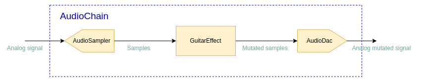

# Firmware Architecture

## The Audio Chain

The audio chain represents the natural signal flow:

The basic principle is that there is an `AudioChain` class which takes three interfaces:

* `AudioSampler` - which shall sample the input and provide the samples to the `AudioChain`, which then applies guitar 
effect on the signal by calling the ...
* `GuitarEffect` - interface, which shall apply the guitar effect; the implementer defines what type of effect it is,
distortion, flanger, chorus, etc.
* `AudioDac` - the mutated samples are supplied by batches to this module, which shall then be converted to analog
signal.

This splitting enables design which is simpler to handle. 
`AudioSampler` and `AudioDac` abstract hardware modules, `GuitarEffect` abstracts a guitar effect, which shall be 
testable on the host machine. 

The batch of samples is a templated type, because its type is an implementation detail. Currently, the batches are 
handled through callbacks, but it shall be refactored to make `AudioSampler` and `AudioDac` awaitable.

There is `AudioChainConfig::BatchOfSamples` type defined which defines the type which is currently used as the type
for batch of samples. It defines the batch size as well (the window size). The window size must be a predefined 
config constant, to know in advance the buffer sizes DMA operates on.

The `ThreadedAudioSampler` and `ThreadedAudioDac` implement the hardware-abstracting interfaces. They operate on the
DMA interrupts and they work in similar fashion. DMA operates on the buffer which is twice the size of the window.
Then, the DMA raises interrupts when half of the buffer is filled and when the buffer is fully filled. The DMA fills
the buffer continuously, the buffer is a circular (ring) buffer. The size of the DMA buffer is twice the window size, 
because on each half-buffer update a full window may be retrieved. This allows continuous sampling without pauses,
and without overwriting of the values.

For the `ThreadedAudioSampler`, on each half-piece update, the freshly updated half-piece is copied from the
DMA buffer, the raw samples are converted according to voltage levels and offset, and such converted samples are 
propagated to the `AudioChain`.

The `ThreadedAudioDac` works in similar way. On each half-piece transfer end, the `AudioChain` is asked for new samples,
which are copied to the DMA buffer (which is obviously not the same DMA buffer used by `ThreadedAudioSampler`). The 
batch is copied to the DMA buffer in such a way to overwrite the previously transferred half-piece.

