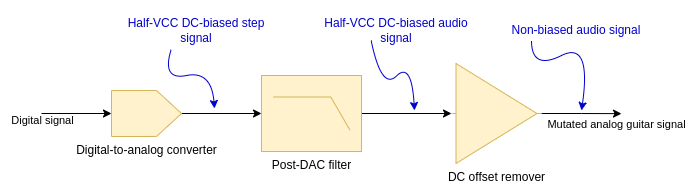

# Jeff's Hardware

The schematic (and not yet the PCB) is created in Kicad. The [Jeff](Jeff) directory contains the Kicad project.

The basic principle of operation is that the analog signal goes to the Analog Front End, which adapts the signal for
the digital stage. The digital stage performs the digital signal processing and applying the actual effect (like 
distortion, flanger, etc.). Then the signal goes through DAC to the post-DAC stage, which adapts the signal to make
it a proper audio signal.

Currently, the ADC, digital signal processing and DAC are done by STM32L432KC Nucleo board.

## Analog Front End

1. The signal from the guitar goes to the buffer amplifier, to isolate from the output impedance, since various guitars
have various output impedances. If we don't use the buffer, the DC offset biasing in the next stage, or the gain
of the next stage may be affected. The buffer needs negative voltage rail, which is supplied by the negative voltage 
generator.
2. After the impedance is set constant, we can apply the DC bias to the AC signal, to adapt the voltage range for the
ADC conversion. This stage also applies the gain to improve the resolution. According to 
[that research](https://sound-au.com/articles/guitar-voltage.htm), we assume around 500 mV peak from the guitar. Since 
the DC bias is half-VCC, where VCC = 3.3V, then the output signal shall have ~1.6 V peak, so the gain can be around 3 - 
currently G = 100 / 33 = 3.(03) [V/V]. The DC-biaser needs voltage reference, which is half-VCC, and that is generated
by the VCC-half splitter.
3. To prevent from the aliasing, we have to filter the >20kHz frequencies. This is not so necessary if only the guitar
is connected, because the highest harmonics it generates are ~8kHz, when playing highest possible sounds, but it might
be good when effects are connected in a cascade. The filter is a SCF, so the cutoff frequency is programmed using
an external clock. This clock is supplied by the microcontroller.

## Post-DAC stage

1. The DAC STM32 hardware modules has its own output buffer, which is enabled by the firmware, thus the external 
buffering is not needed.
2. The post-DAC filter has the same design as the anti-aliasing filter.
3. DC offset remover needs the VCC-half splitter and the negative voltage rail generator.

## Miscellaneous 

### Negative voltage generator

Charge pump IC is used to generate the negative voltage rail.

### VCC half-splitter

To generate reference voltage for DC-biasing circuit and for the DC offset removal circuit, the VCC-half splitter is
needed. Currently, we use the same charge pump IC, like for the negative voltage generator.
