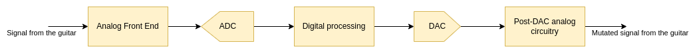
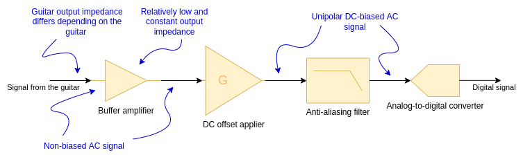

# Jeff's Hardware

The schematic (and not yet the PCB) is created in Kicad. The [Jeff](Jeff) directory contains the Kicad project.

The basic principle of operation is that the analog signal goes to the Analog Front End, which adapts the signal for
the digital stage. The digital stage performs the digital signal processing and applying the actual effect (like 
distortion, flanger, etc.). Then the signal goes through DAC to the post-DAC stage, which adapts the signal to make
it a proper audio signal.

Currently, the ADC, digital signal processing and DAC are done by STM32L432KC Nucleo board.

## Analog Front End

1. The signal from the guitar goes to the buffer amplifier, to isolate from the output impedance, since various guitars
have various output impedances. If we don't use the buffer, the DC offset biasing in the next stage, or the gain
of the next stage may be affected.
2. After the impedance is set constant, we can apply the DC bias to the AC signal, to adapt the voltage range for the
ADC conversion. This stage also applies the gain to improve the resolution. According to 
[that research](https://sound-au.com/articles/guitar-voltage.htm), we assume around 500 mV peak from the guitar. Since 
the DC bias is half-VCC, where VCC = 3.3V, then the output signal shall have ~1.6 V peak, so the gain can be around 3 - 
currently G = 100 / 33 = 3.(03) [V/V].
3. To prevent from the aliasing, we have to filter the >20kHz frequencies. This is not so necessary if only the guitar
is connected, because the highest harmonics it generates are ~8kHz, when playing highest possible sounds, but it might
be good when effects are connected in a cascade.
